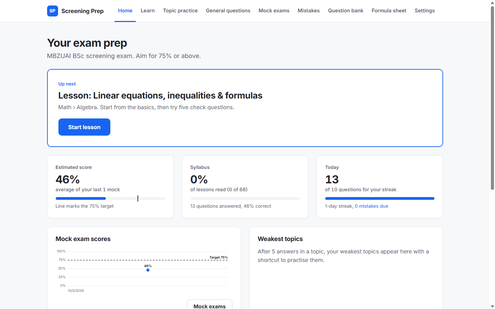
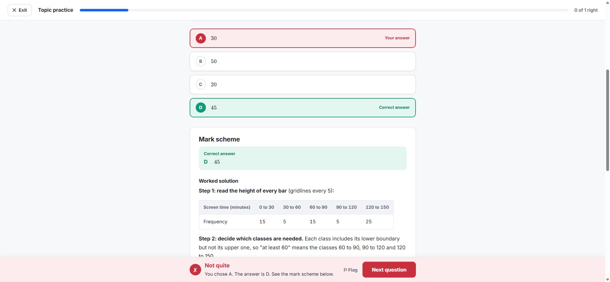
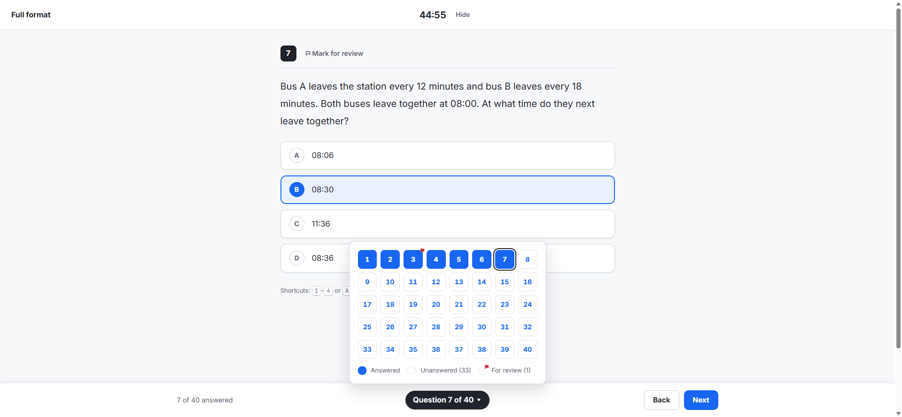
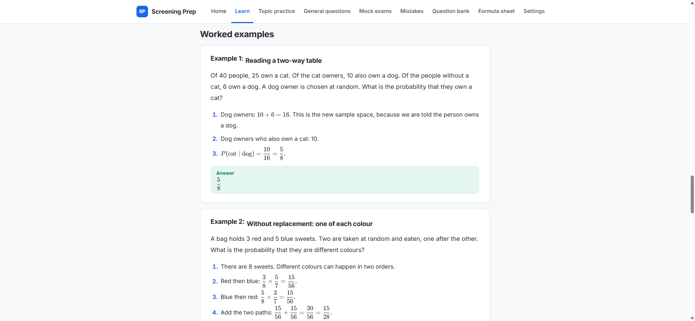
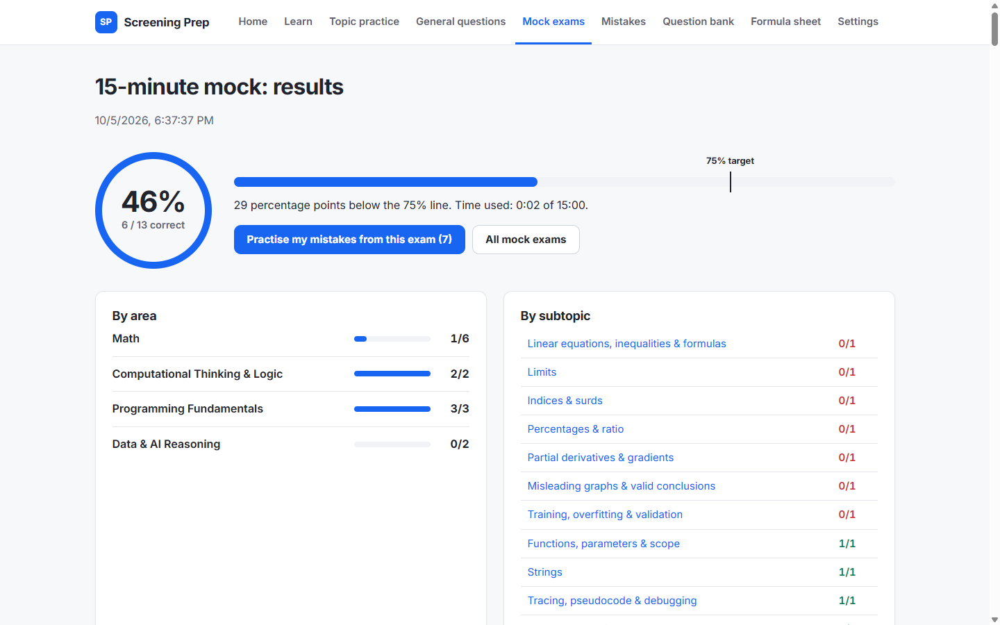
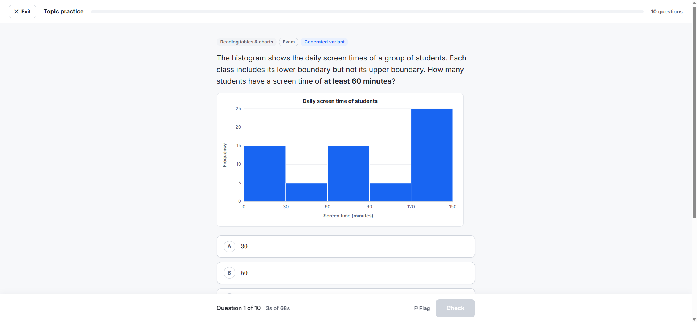
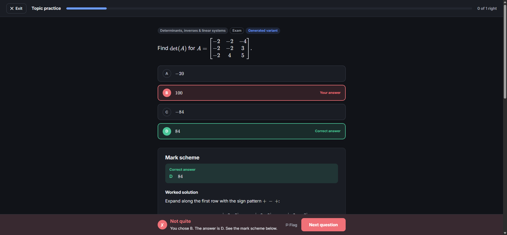

<div align="center">

# Screening Prep

**A complete revision site for the MBZUAI BSc in Artificial Intelligence screening exam.**

Lessons for every topic · 1,304 hand-written questions · 181 generators that never run out · timed mock exams

**[Open the live site](https://bouwles.github.io/mbzuai-screening-prep/)**

Made by Paul Nercessian



</div>

> Unofficial personal study tool. Not affiliated with or endorsed by MBZUAI. Every question is original practice material, not a real exam question.

## What's inside

| | |
|---|---|
| **Learn** | 66 lessons, one per subtopic of MBZUAI's published syllabus: plain-English explanation, key formulas, worked examples, common traps, an exam tip and five check questions. Plus a printable formula sheet. |
| **Topic practice** | Pick topics, a difficulty (Foundation / Exam / Challenge / Mixed) and 10, 20, 30 or endless questions. Instant feedback and a full mark scheme after every answer, with a timer against real exam pace. |
| **General questions** | An endless mixed feed from the whole syllabus that leans towards your weakest topics. |
| **Question bank** | Browse and search every question by area, topic, subtopic, difficulty and status (unseen / correct / wrong / flagged). |
| **Mock exams** | 15, 30 and 60 minute mocks (60 minutes is the official BSc exam length) plus the 40-question / 45-minute full format. Countdown timer, navigator, flags, Submit only after the last question, auto-submit at zero, resumes after a reload. Results with a 75% line, breakdown by topic and a full review. |
| **Mistakes** | Spaced repetition: wrong answers come back after 1, 3, 7 and 14 days. Generated questions come back with new numbers. |
| **Dashboard** | Accuracy, streak, recent mock scores against the 75% target, weakest topics, and "continue where you left off". |

<table>
<tr>
<td></td>
<td></td>
</tr>
<tr>
<td></td>
<td></td>
</tr>
<tr>
<td></td>
<td></td>
</tr>
</table>

### Every question has a full mark scheme

1. The correct answer, stated clearly.
2. A step-by-step worked solution (code questions are traced line by line).
3. Why each wrong option is wrong, naming the mistake that leads to it.
4. The key idea in one sentence.
5. A link to the lesson.

## Syllabus

Areas and topics mirror MBZUAI's published list for the BSc screening exam:

- **Math**: Algebra, Functions, Probability, Statistics, Matrix and Vectors, Calculus, Discrete Mathematics
- **Computational Thinking & Logic**: Logic, Pattern Recognition
- **Programming Fundamentals**: Algorithmic Problem Solving, Basic Syntax Concepts, Functions, Basic Data Structures
- **Data & AI Reasoning**: Data Interpretation, Basic Machine Learning Concepts

These are split into 66 subtopics (see `src/syllabus.ts`). Research notes on the real exam, with sources, are in [RESEARCH_NOTES.md](RESEARCH_NOTES.md).

## Run it on your computer

You need [Node.js](https://nodejs.org) (version 20.19 or newer). Then, in a terminal opened in this folder (VS Code: *Terminal → New Terminal*):

```bash
npm install
npm run dev
```

Open the address it prints (usually http://localhost:5173). Works the same on Windows and macOS, and works offline once installed.

Other commands:

| Command | What it does |
|---|---|
| `npm test` | Runs the full test suite (checks every question and 2,000 variants of every generator) |
| `npm run build` | Builds the static site into `dist/` |
| `npm run preview` | Serves the built site locally |

## Your progress

- Saved in your browser's `localStorage` (key `mbzuai-prep-v1`) immediately after every answer. Closing the tab never loses anything.
- Nothing is sent anywhere: there is no server and no account.
- **Moving between your PC and MacBook:** Settings → *Export progress* downloads a `.json` file. On the other computer, Settings → *Import progress* and pick that file.
- Settings → *Reset progress* wipes everything (it asks first).

## Changing the exam settings

Everything about the exam lives in one file: [`src/config/exam.ts`](src/config/exam.ts).

- `targetPercent`: the target line (75).
- `mockFormats`: each mock's minutes and question count.
- `areaWeights`: share of each area in a mock (estimates; MBZUAI doesn't publish them).
- `difficultyMix`, `generatedShare`, `mistakeIntervalsDays`, `streakDailyTarget`.

When you read the real question count and timing in the applicant portal, change the numbers there and save. The running site updates instantly.

## Adding questions

Questions live in one file per subtopic: `src/questions/<area>/<topic>/<subtopic>.ts`. Copy an existing question and edit it:

```ts
{
  id: 'quadratics-019',            // unique
  subtopic: 'quadratics',          // must match the file name
  difficulty: 'exam',              // 'foundation' | 'exam' | 'challenge'
  stem: 'Solve $x^2 - 5x + 6 = 0$.',
  options: ['$x = 2$ or $x = 3$', '$x = -2$ or $x = -3$', '$x = 1$ or $x = 6$', '$x = 5$ or $x = 6$'],
  correctIndex: 0,
  markScheme: {
    solution: 'Factorise: $(x - 2)(x - 3) = 0$, so $x = 2$ or $x = 3$.',
    whyWrong: [null, 'Signs flipped: ...', 'Factor pair of 6 that does not add to 5: ...', 'Confused ...'],
    keyIdea: 'Find two numbers that multiply to $c$ and add to $-b$... ',
  },
  check: { optionValues: [/* value of each option */], compute: () => /* recompute the answer */ 0 },
},
```

- Write maths inside `$...$` (inline) or `$$...$$` (display). In the `.ts` file, backslashes are doubled: `'\\frac{1}{2}'`.
- Options are shuffled on screen, so explanations never mention a letter.
- For Python "what does this print" questions add `code: { lang: 'python', source: '...' }` and `python: { stdout: '...' }`; the tests run the code for real.
- Generators live in `src/generators/...` and lessons in `src/lessons/...`; new files are picked up automatically.
- Run `npm test` afterwards. It fails with a clear message if anything is off.

## How correctness is checked

`npm test` runs 353 tests:

- Every static question: exactly 4 distinct options, a valid answer, a full mark scheme with an explanation for every wrong option, and every piece of LaTeX rendered through KaTeX in strict mode (it also rejects maths typed as plain text, `1x`, `+ -3` and similar).
- Every question whose answer is a value is recomputed in code and must match the marked option (and no other option).
- Every Python output question (175 of them) is run with real Python 3 and its output compared with the marked option. If Python isn't installed, the test prints the list of question ids to check by hand instead of failing.
- Every generator: 2,000 variants each, checking one correct option, four distinct options, no `NaN`/`undefined`, clean LaTeX, and that the worked solution ends on the correct answer.
- Every lesson has the required sections, and every subtopic has a lesson, at least 15 questions and at least one generator.

On top of the automated tests, each subtopic was written and then independently re-solved by a separate reviewer, question by question.

## Design

The look is based on the revision and test-prep tools students already know: Khan Academy, Brilliant, Quizlet, Duolingo and the College Board Bluebook exam app.

- Light theme by default (dark theme in Settings), one blue accent, and green/red used only for right and wrong.
- Practice runs in a focus view: exit at the top left, a thin progress bar, the question in a centred column, and **Check / Next at the bottom right**. Feedback appears in the bottom bar; the mark scheme opens below the question.
- Mock exams copy the Bluebook layout: timer at the top centre (you can hide it), a question navigator at the bottom centre, Back / Next at the bottom right.
- All maths is typeset with KaTeX, code is syntax-highlighted with line numbers, and charts are drawn as SVG.
- No animations or transitions anywhere. Keyboard: `1`–`4` or `A`–`D` choose, `Enter` checks / continues, `F` flags, `←` `→` move in mock exams.

## Tech

Vite + React + TypeScript, plain CSS, [KaTeX](https://katex.org) for maths, [highlight.js](https://highlightjs.org) for Python, self-hosted Inter and JetBrains Mono, Vitest. Charts are hand-drawn SVG. Build tooling also uses `@vitejs/plugin-react` and type packages (`@types/*`), which are development-only.

Deployed to GitHub Pages by `.github/workflows/deploy.yml` on every push to `main`.

---

Made by Paul Nercessian
